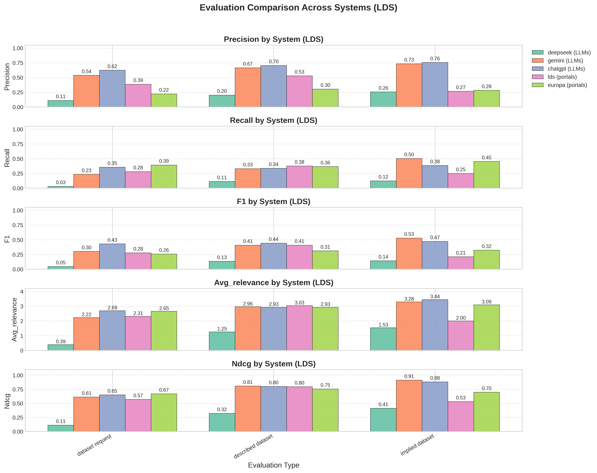
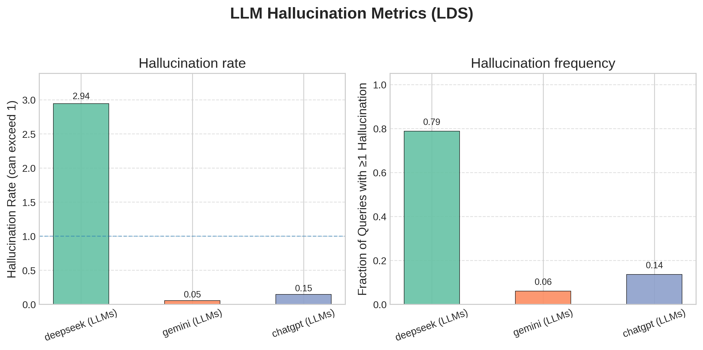
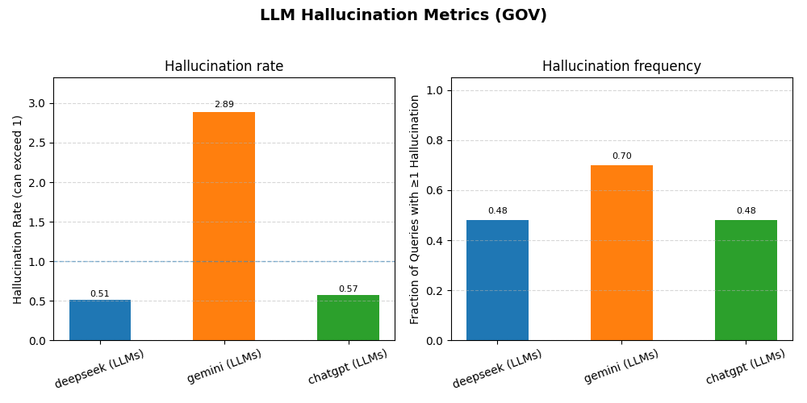

# OpenDataBench

**OpenDataBench** is an open-source benchmark for evaluating **natural language dataset discovery** across open data portals and large language models (LLMs).  
It provides curated evaluation datasets, baseline results, evaluation scripts, and visualization tools to assess retrieval performance in multilingual, real-world settings.

---

## ✨ Key Features

**Multilingual benchmark datasets**  
  - **London Datastore (LDS)** — 68 English queries (municipal-scale).  
  - **GovData.de** — 50 German queries (national-scale).  
  - All queries come with **human-annotated ground truth** datasets and **graded relevance scores (0–4)**.  

## 📊 Benchmark Results

The benchmark currently covers both **London Datastore (LDS, English)** and **GovData.de (German)**.  
Below we show evaluation plots and tables summarizing baseline performance.

---

### 🏙️ London Datastore (LDS)

**Evaluation Metrics (Precision, Recall, F1, Relevance, nDCG@5):**



**LLM Hallucination Metrics (Rate & Frequency):**



**Quantitative Results (averaged across queries):**

| System        | Precision | Recall | F1    | Avg. Relevance | nDCG  | Hallucination Rate | Hallucination Freq. |
|---------------|-----------|--------|-------|----------------|-------|---------------------|----------------------|
| DeepSeek      | 0.111–0.255 | 0.030–0.123 | 0.046–0.143 | 0.389–1.529 | 0.111–0.412 | **2.944** | **0.788** |
| Gemini        | 0.537–0.734 | 0.234–0.503 | 0.303–0.529 | 2.222–3.284 | 0.611–0.911 | 0.054 | 0.061 |
| ChatGPT       | 0.624–0.755 | 0.337–0.383 | 0.430–0.472 | 2.686–3.441 | 0.651–0.880 | 0.147 | 0.136 |
| LDS (portal)  | 0.267–0.529 | 0.248–0.375 | 0.212–0.408 | 2.000–3.030 | 0.531–0.795 | 0.000 | 0.000 |
| Europa        | 0.222–0.304 | 0.365–0.451 | 0.257–0.323 | 2.648–3.088 | 0.669–0.754 | 0.000 | 0.000 |

---

### 🇩🇪 GovData.de (GOV)

**Evaluation Metrics (Precision, Recall, F1, Relevance, nDCG@5):**


**LLM Hallucination Metrics (Rate & Frequency):**



**Quantitative Results (averaged across queries):**

| System        | Precision | Recall | F1    | Avg. Relevance | nDCG  | Hallucination Rate | Hallucination Freq. |
|---------------|-----------|--------|-------|----------------|-------|---------------------|----------------------|
| DeepSeek      | 0.364–0.453 | 0.258–0.285 | 0.278–0.318 | 2.146–2.750 | 0.573–0.692 | 0.511 | 0.480 |
| Gemini        | 0.062–0.278 | 0.031–0.149 | 0.041–0.174 | 0.400–1.333 | 0.072–0.278 | **2.889** | **0.700** |
| ChatGPT       | 0.208–0.542 | 0.081–0.266 | 0.111–0.340 | 1.134–2.583 | 0.275–0.634 | 0.573 | 0.480 |
| GovData (portal) | 0.075–0.331 | 0.062–0.228 | 0.066–0.261 | 1.000–1.973 | 0.189–0.436 | 0.000 | 0.000 |
| Europa        | 0.123–0.219 | 0.139–0.219 | 0.128–0.211 | 1.150–2.667 | 0.263–0.543 | 0.000 | 0.000 |


## Baselines

The benchmark currently includes the following **baselines** for comparison:

- **Native portal search** — keyword-based search using the portals’ own CKAN interfaces:  
  - [London Datastore](https://data.london.gov.uk/) (English, municipal-scale)  
  - [GovData.de](https://www.govdata.de/) (German, national-scale)  

- **[data.europa.eu](https://data.europa.eu/)** — an aggregator portal that federates datasets from national and municipal portals, including LDS and GovData.  

- **ChatGPT-5.0** — instructed to return datasets specifically from the target portal.  

- **Gemini 2.5 Flash** — same setup as ChatGPT.  

- **DeepSeek 3.1** — search-enabled, restricted to the target portal by prompting.  

- **Ground truth annotations**  
  - 118 natural language queries.  
  - Fine-grained relevance scores (0–4).  

- **Evaluation metrics**  
  - Precision, Recall, F1.  
  - Average Relevance.  
  - nDCG@5.  
  - Hallucination Frequency & Rate (LLMs only).  

- **Reproducible evaluation pipeline**  
  - Scripts to compute baselines and generate plots.  
  - Outputs figures in `docs/figures/`.  

---

## 🧾 Query Styles

Following Walker et al. (2023) [Prompting Datasets: Data Discovery with Conversational Agents](https://arxiv.org/abs/2312.09947),  
we distinguish between three main ways that people express dataset needs:

| Query Style        | Example | Explanation |
|--------------------|---------|-------------|
| **Dataset Request** | “Can you find me the *German credit fairness dataset*?” | The dataset is explicitly named or requested directly. |
| **Described Dataset** | “Provide me with datasets about *Islamophobia in Italian Tweets* labelled as hate speech.” | The dataset is not named, but its properties/content are described. |
| **Implied Dataset** | “What was the *average property price in London from 2000–2010*?” | The request implies that a dataset is needed to answer, without naming it as a dataset. |

These three modes form the basis of our benchmark evaluation.

## 📂 Repository Structure
```
OpenDataBench/
│
├── data/ # Evaluation datasets (GovData, LDS)
│ ├── evaluation_dataset_GOV.json
│ ├── evaluation_dataset_LDS.json
│ └── README.md
│
├── results/ # Raw system outputs (LLMs and portals)
│ ├── GOV/
│ └── LDS/
│
├── baselines/ # Evaluated baseline JSONs
│ ├── GOV/
│ └── LDS/
│
├── scripts/ # Evaluation and visualization scripts
│ ├── compare_baseline.py
│ ├── metrics_dashboard.py
│ └── README.md
│
├── docs/ # Documentation and figures
│ ├── methodology.md
│ └── figures/
│ ├── GOV/
│ └── LDS/
│
├── requirements.txt # Python dependencies
└── README.md # Main repository overview
```

---

## 🚀 Quickstart

Clone the repo and install dependencies:

```bash
git clone https://github.com/your-username/OpenDataBench.git
cd OpenDataBench
pip install -r requirements.txt
```
Run evaluation for GovData.de:
```bash
cd scripts
python compare_baseline.py
python metrics_dashboard.py
```

Switch to London Datastore (LDS) by editing the DATASET variable in the scripts:
```bash
DATASET = "LDS"
```

Outputs:
```bash
Baseline JSONs → baselines/{DATASET}/

Figures → docs/figures/{DATASET}/
```
📖 Documentation

Methodology
 — detailed description of benchmark design, baselines, and metrics.

Scripts Guide
 — how to run evaluation and visualization scripts.

📊 Example Figures

Evaluation metrics and hallucination comparisons are automatically generated in docs/figures/{DATASET}/.

📜 License

This project is released under the MIT License.


## 🔮 Limitations & Future Work

- **Single-turn focus**:  
  The current benchmark only evaluates **first-turn queries** (single queries).  
  This allows us to standardize evaluation and ground truth, but it does not yet capture multi-turn interactions.  

- **Planned extensions**:  
  1. **Larger query set** — expanding the number and diversity of queries across domains.  
  2. **Multi-turn conversations** — extending the benchmark to support follow-up queries and conversational dataset discovery.  
